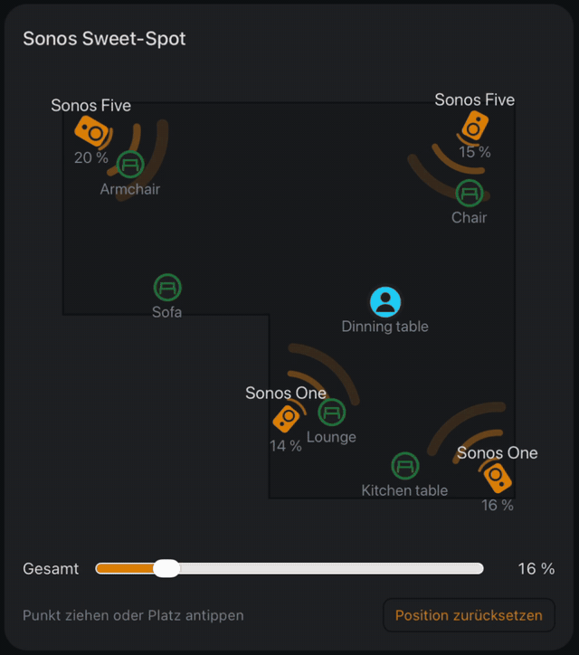
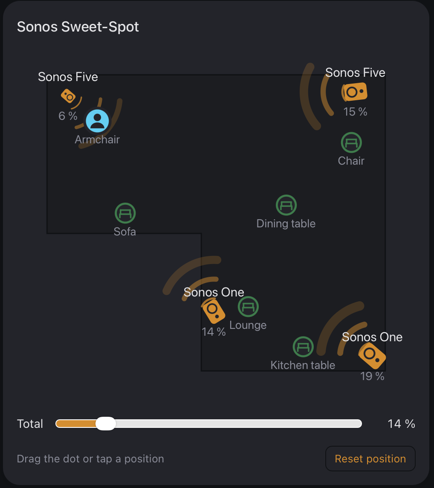
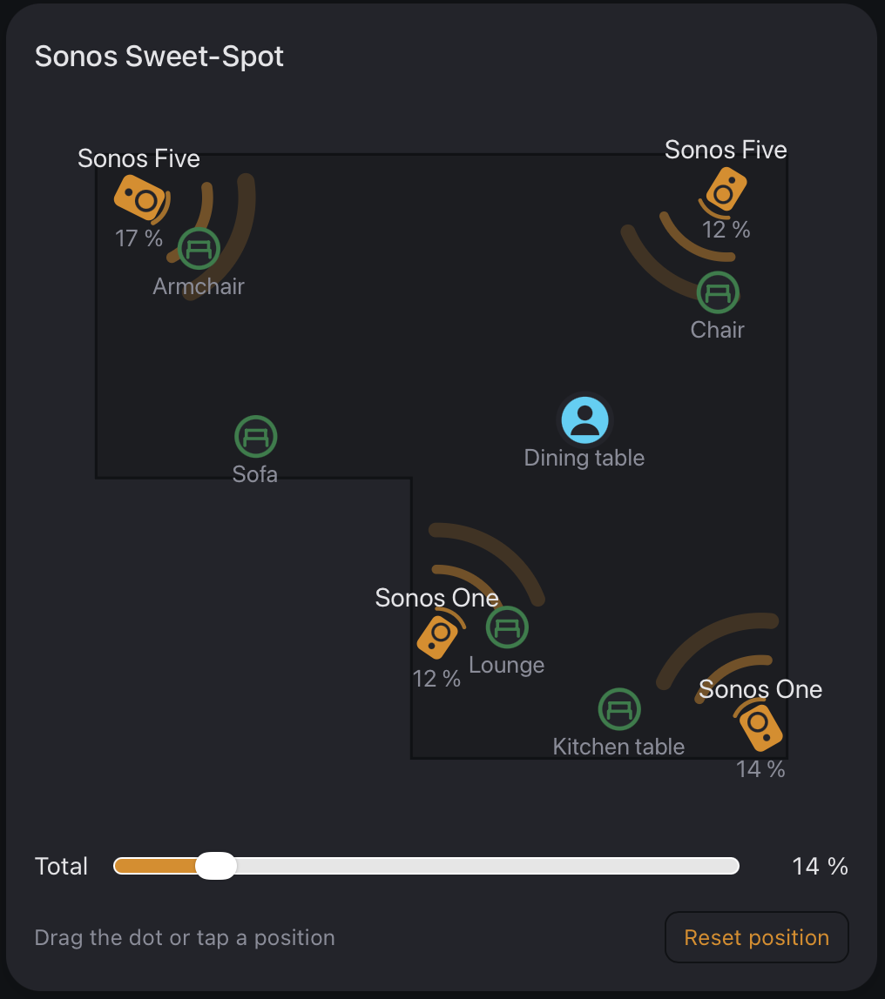
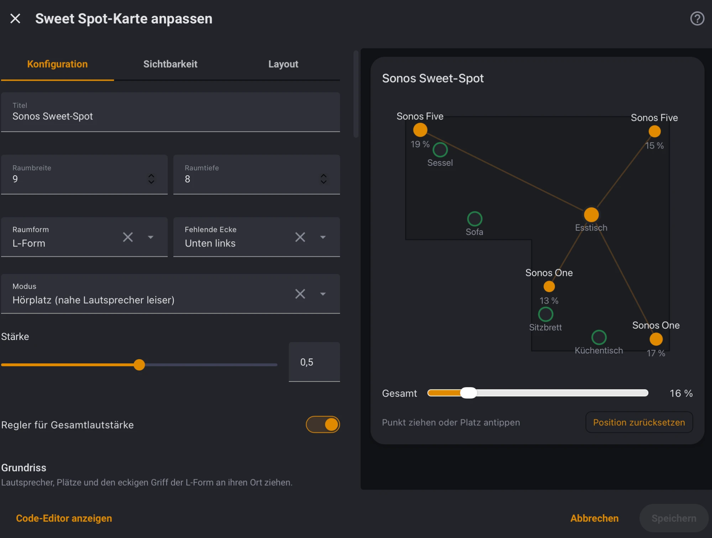

# Sweet Spot Card

A Home Assistant dashboard card for rooms with several speakers. You drag a dot to where you sit, and the card balances the speakers around it: speakers close to you get quieter, the ones further away louder. The average volume stays the same, only the ratio between the speakers changes.

Works with any `media_player` that supports `volume_set` (Sonos, HEOS, Cast, …).



<p>
  
  
</p>

Sitting in the armchair next to the top-left speaker (left) and at the dining table in the middle of the room (right). The percentages are the volumes the speakers get; the average stays the same.



## Quick start

1. Install the card with HACS (see below) and reload the browser.
2. Edit a dashboard, add the *Sweet Spot Card* and pick your speakers.
3. Drag the speakers on the floor plan to where they stand, and set the room size and shape.
4. Under *Quick setup*, enter your listening places (e.g. `Sofa, Dining table, Kitchen`) and press *Set up places*. This creates the two helpers and the automation for you (administrator account needed).
5. Drag the places to where you sit and save.

Now tap a place on the card, or switch it from voice assistants and automations, and the volumes follow. Prefer to do it by hand? See [Saved places](#saved-places).

## When it makes sense

The card balances `media_player` entities against each other. That works best with several single speakers spread around one room, each playing on its own.

- **Stereo pairs and home theater sets** (e.g. a soundbar with rear speakers) show up in Home Assistant as *one* media player with one volume. The card treats them as one speaker: place it in the middle between its boxes. You can balance a pair against other speakers or pairs, but not left against right within the pair.
- **One pair or one set only:** then there is just one point on the plan and nothing to balance, so the card is of no use.
- The speakers need individual volume control in Home Assistant. Speakers that only follow a shared group volume cannot be balanced.

## Installation

### HACS

1. HACS → three-dot menu → *Custom repositories*
2. Repository `https://github.com/T-o-n-i/sweet-spot-card`, type *Dashboard*
3. Install *Sweet Spot Card* and reload the browser

### Manual

Copy `sweet-spot-card.js` to `/config/www/` and add it as a dashboard resource: `/local/sweet-spot-card.js`, type *JavaScript module*.

## Visual editor

Add the card from the dashboard editor and set it up there: room size and shape (rectangle or L-shape), mode, strength, speakers and places. The floor plan in the editor lets you drag speakers, places and the corner of the L-shape into position. When you choose an `input_select` for the places, the editor creates one place per option.

## Minimal configuration

Without any helpers the card sets the speaker volumes directly while you drag.

```yaml
type: custom:sweet-spot-card
title: Living room
room:
  width: 6      # any unit, metres are handy
  height: 4
speakers:
  - entity: media_player.left
    name: Left
    x: 0.3
    y: 0.3
  - entity: media_player.right
    name: Right
    x: 5.7
    y: 0.3
```

Coordinates start in the top-left corner of the room.

## Colours

The card uses your theme: speakers in the primary colour, places in the success colour and the dot in the accent colour. If two of them look alike in your theme (for example primary and accent are both orange), the card picks the next theme colour instead: info, purple, blue, teal or red.

## Options

| Option | Default | Description |
|---|---|---|
| `title` | – | Card title |
| `room.width`, `room.height` | required | Size of the room |
| `room.shape` | `rectangle` | `rectangle` or `l` |
| `room.cutout` | – | For `shape: l`: the missing corner as `corner` (`bottom-left`, `bottom-right`, `top-left`, `top-right`), `width` and `height` |
| `room.outline` | – | Any other shape as a list of `[x, y]` points. Wins over `shape`; the editor can only show it |
| `room.image` | – | Background image instead of the outline, e.g. `/local/floorplan.png` |
| `speakers` | required | At least two, each with `entity`, `x`, `y`, optional `name`, `id` and `trim` |
| `mode` | `listener` | `listener`: nearer speakers get quieter. `fader`: nearer speakers get louder, like the fader in a car |
| `strength` | `0.5` | 0 = no effect, 1 = full compensation for distance. Rooms reflect sound, so full compensation usually overdoes it |
| `min_distance` | `0.5` | Distances below this count as this value, so standing right next to a speaker does not mute it |
| `master` | `true` | Show a slider for the overall volume. It raises or lowers all speakers together and keeps the balance |
| `positions` | – | Saved listening positions, see below |

## Saved places

If you have fixed places (sofa, dining table, …), the card can remember a balance for each of them. With the blueprint below, switching the place also works from voice assistants and automations, without the dashboard.

### Setup with the blueprint (recommended)

The *Quick setup* in the card editor does all of this for you. To set it up by hand:

1. Create two helpers under *Settings → Devices & services → Helpers*:
   - a **Dropdown** (`input_select`) with one option per place, e.g. *Sofa*, *Dining table*
   - a **Text** (`input_text`) with maximum length **255**, the card's memory
2. In the card editor, choose the dropdown as *Selection*, the text helper as *Memory*, and switch on *Volumes are set by the Sweet Spot automation*. The editor creates one place per option; drag them into position.
3. Import the blueprint and create an automation from it with the same dropdown, text helper and speakers:

   [](https://my.home-assistant.io/redirect/blueprint_import/?blueprint_url=https%3A%2F%2Fgithub.com%2FT-o-n-i%2Fsweet-spot-card%2Fblob%2Fmain%2Fblueprints%2Fautomation%2Fsweet_spot_card%2Fapply_place.yaml)

   or import `https://github.com/T-o-n-i/sweet-spot-card/blob/main/blueprints/automation/sweet_spot_card/apply_place.yaml` under *Settings → Automations → Blueprints*.

Now tap a place on the card, or select it from anywhere else (`input_select.select_option`), and the automation sets the volumes. When you drag the dot, the card saves the new balance and the automation applies it.

The memory holds the position and the balance of every place. 255 characters are enough for about five places with four speakers, fewer with long place names. The card warns when it is full.

### Configuration

```yaml
positions:
  entity: input_select.listening_place
  storage: input_text.sweet_spot_memory
  apply: automation
  items:
    - option: Sofa
      x: 2.0
      y: 3.6
    - option: Dining table
      name: Table         # optional label, defaults to the option
      x: 6.3
      y: 2.9
```

Each item needs `option` (the `input_select` option it stands for), `x` and `y`. `name` changes the label on the card without touching the option.

- **`storage`**: the `input_text` where the card keeps the position and balance of each place. The marker of the active place moves with the dot, and *Reset position* puts it back to the `x`/`y` from the configuration.
- **`apply: automation`**: the card only saves, the blueprint automation sets the volumes. Without it, the card sets the volumes itself when you release the dot, which only works while the dashboard is open.

### Alternative: one helper per place and speaker

`weight_entity` writes the balance into `input_number` helpers (range −1 to 1, step 0.1) instead, one per place and speaker, e.g. `input_number.balance_{position}_{speaker}`. `{position}` is replaced by the item `id`, `{speaker}` by the speaker `id`. You then need your own automation that turns these values into volumes. This is how the card started out; for new setups the blueprint is simpler.

## Speakers of different size

Bigger speakers play louder at the same volume setting. Give each speaker a `trim` to even that out, on the same scale as the balance: `-0.3` gives it about 80 % of the volume, `-1` half, `+1` double. In the editor this is the *Level correction* slider.

To find the value, put the dot where you are about equally far from all speakers and lower the louder ones until everything sounds equally loud. A fixed factor is an approximation; it fits normal listening levels best.

When you change `trim`, speaker positions, the room, `mode` or `strength`, the card recalculates the saved balance of every place, keeping the positions you dragged. If several cards share the same memory helper, give them the same configuration, otherwise the card loaded last wins.

## Grouped speakers

When something is playing, the card shows speakers that are not in the playing group as a dashed circle marked *not in group*. They are left out of the balance and the overall volume, so they keep whatever they are doing. Tap such a speaker to add it to the group, or use *Group all*. A joining speaker gets its share of the current volume, not its old volume, so nothing suddenly gets loud.

The playing group is the one holding most of the card's speakers; on a tie, the one that started last.

With the blueprint, switch on **Group automatically** to do this whenever the place changes, including speakers that play something else. Grouping needs an integration that supports it (Sonos, HEOS, Squeezebox, Music Assistant, …); for others the card shows nothing.

## Overall volume

The slider below the room shows the average volume of all speakers. Moving it sets a new average and keeps the balance. With an active place, the balance is taken from the memory (or the helpers), so repeated changes at low volumes do not drift because of rounding.

## Using the keyboard

The listening position can be moved with the arrow keys once it has the focus (hold Shift for bigger steps). Places and speakers outside the group react to Enter and Space.

## Troubleshooting

- **"Custom element doesn't exist: sweet-spot-card"** after installing or updating: the browser still uses its old copy. Reload with Ctrl/Cmd + Shift + R; in the companion app, use *Settings → Companion app → Debugging → Reset frontend cache*.
- **Nothing happens when you switch places:** check that the automation from the blueprint is on and uses the same helpers and speakers as the card.
- **"The memory helper is full":** the `input_text` must have a maximum length of 255; shorter place names or fewer places help.
- **A speaker shows "not in group":** it is not part of the playing group. Tap it, or turn on *Group automatically* in the automation.

So far the card has been tested with Sonos speakers. Reports about other systems are welcome in the issues.

## How the balance is calculated

For each speaker the card takes the distance *d* to the dot and the geometric mean *g* of all distances. The weight is `strength × log2(d / g)`, limited to −1…+1 (negated in `fader` mode). The volume is then `mean × 2^weight / average(2^weights)`, rounded to whole percent.

## Development

`dev/index.html` renders the card against a mocked Home Assistant. Serve the repository root (e.g. `python3 -m http.server`) and open `/dev/index.html`. `node test.mjs` checks the calculation.

## License

MIT
